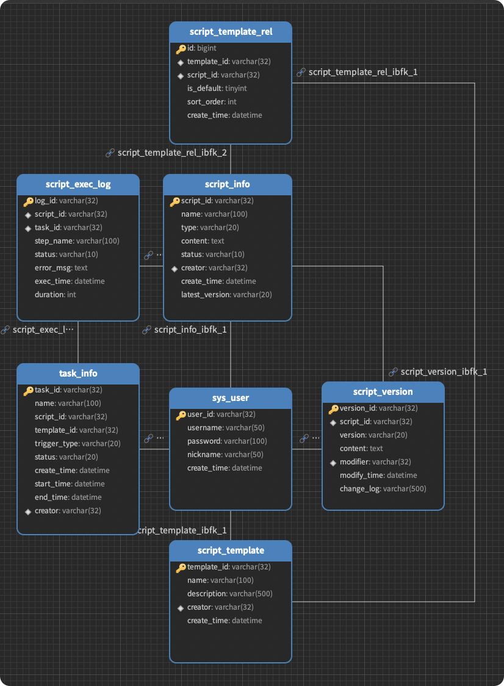

## # AbsTool

## 数据库

#### 1. 用户信息表 (`sys_user`)

用于存储系统的用户信息，包括创建者、修改者等。

| 字段名        | 类型           | 约束 / 默认值             | 说明        |
| :------------ | :------------- | :------------------------ | :---------- |
| `user_id`     | `varchar(32)`  | **PRIMARY KEY**, NOT NULL | 用户唯一 ID |
| `username`    | `varchar(50)`  | NOT NULL                  | 用户名      |
| `password`    | `varchar(100)` | NOT NULL                  | 密码        |
| `nickname`    | `varchar(50)`  | DEFAULT NULL              | 昵称        |
| `create_time` | `datetime`     | NOT NULL                  | 创建时间    |

------

#### 2. 脚本模板表 (`script_template`)

用于定义脚本的集合（模板），支持将多个脚本编排为一个工作流。

| 字段名        | 类型           | 约束 / 默认值             | 说明     |
| :------------ | :------------- | :------------------------ | :------- |
| `template_id` | `varchar(32)`  | **PRIMARY KEY**, NOT NULL | 模板 ID  |
| `name`        | `varchar(100)` | NOT NULL                  | 模板名称 |
| `description` | `varchar(500)` | DEFAULT NULL              | 模板描述 |
| `creator`     | `varchar(32)`  | FK -> `sys_user(user_id)` | 创建人   |
| `create_time` | `datetime`     | NOT NULL                  | 创建时间 |

------

#### 3. 脚本信息表 (`script_info`)

存储脚本的基本元数据和当前状态。

| 字段名           | 类型           | 约束 / 默认值             | 说明        |
| :--------------- | :------------- | :------------------------ | :---------- |
| `script_id`      | `varchar(32)`  | **PRIMARY KEY**, NOT NULL | 脚本唯一 ID |
| `name`           | `varchar(100)` | NOT NULL                  | 脚本名称    |
| `type`           | `varchar(20)`  | NOT NULL                  | 类型        |
| `content`        | `text`         | NOT NULL                  | 脚本内容    |
| `status`         | `varchar(10)`  | NOT NULL                  | 状态        |
| `creator`        | `varchar(32)`  | FK -> `sys_user(user_id)` | 创建人 ID   |
| `create_time`    | `datetime`     | NOT NULL                  | 创建时间    |
| `latest_version` | `varchar(20)`  | NOT NULL                  | 最新版本号  |

------

#### 4. 脚本版本表 (`script_version`)

用于脚本的版本控制，记录脚本的历史变更。

| 字段名        | 类型           | 约束 / 默认值                            | 说明           |
| :------------ | :------------- | :--------------------------------------- | :------------- |
| `version_id`  | `varchar(32)`  | **PRIMARY KEY**, NOT NULL                | 版本 ID        |
| `script_id`   | `varchar(32)`  | NOT NULL, FK -> `script_info(script_id)` | 关联脚本 ID    |
| `version`     | `varchar(20)`  | NOT NULL                                 | 版本号         |
| `content`     | `text`         | NOT NULL                                 | 该版本脚本内容 |
| `modifier`    | `varchar(32)`  | FK -> `sys_user(user_id)`                | 修改人 ID      |
| `modify_time` | `datetime`     | NOT NULL                                 | 修改时间       |
| `change_log`  | `varchar(500)` | DEFAULT NULL                             | 变更日志       |

------

#### 5. 脚本-模板关联表 (`script_template_rel`)

连接脚本与模板，定义模板中包含哪些脚本以及它们的执行顺序。

| 字段名        | 类型          | 约束 / 默认值                                  | 说明               |
| :------------ | :------------ | :--------------------------------------------- | :----------------- |
| `id`          | `bigint(20)`  | **PRIMARY KEY**, AUTO_INCREMENT                | 关联记录 ID        |
| `template_id` | `varchar(32)` | NOT NULL, FK -> `script_template(template_id)` | 关联模板 ID        |
| `script_id`   | `varchar(32)` | NOT NULL, FK -> `script_info(script_id)`       | 关联脚本 ID        |
| `is_default`  | `tinyint(4)`  | NOT NULL                                       | 是否为模板默认脚本 |
| `sort_order`  | `int(11)`     | NOT NULL                                       | 脚本执行顺序       |
| `create_time` | `datetime`    | NOT NULL                                       | 关联创建时间       |

------

#### 6. 任务信息表 (`task_info`)

记录每一次执行实例（无论是单脚本执行还是模板执行）。

| 字段名         | 类型           | 约束 / 默认值             | 说明                             |
| :------------- | :------------- | :------------------------ | :------------------------------- |
| `task_id`      | `varchar(32)`  | **PRIMARY KEY**, NOT NULL | 任务 ID                          |
| `name`         | `varchar(100)` | NOT NULL                  | 任务名称                         |
| `script_id`    | `varchar(32)`  | DEFAULT NULL              | 关联脚本ID (单脚本任务)          |
| `template_id`  | `varchar(32)`  | DEFAULT NULL              | 关联模板ID (模板任务)            |
| `trigger_type` | `varchar(20)`  | NOT NULL                  | 触发方式 (e.g. MANUAL, SCHEDULE) |
| `status`       | `varchar(20)`  | NOT NULL                  | 任务整体状态                     |
| `create_time`  | `datetime`     | NOT NULL                  | 创建时间                         |
| `start_time`   | `datetime`     | DEFAULT NULL              | 开始执行时间                     |
| `end_time`     | `datetime`     | DEFAULT NULL              | 结束时间                         |
| `creator`      | `varchar(32)`  | FK -> `sys_user(user_id)` | 执行人                           |

------

#### 7. 脚本执行日志表 (`script_exec_log`)

记录任务中每一个执行步骤的详细日志。

| 字段名      | 类型           | 约束 / 默认值                            | 说明          |
| :---------- | :------------- | :--------------------------------------- | :------------ |
| `log_id`    | `varchar(32)`  | **PRIMARY KEY**, NOT NULL                | 日志 ID       |
| `script_id` | `varchar(32)`  | NOT NULL, FK -> `script_info(script_id)` | 脚本 ID       |
| `task_id`   | `varchar(32)`  | NOT NULL, FK -> `task_info(task_id)`     | 关联任务 ID   |
| `step_name` | `varchar(100)` | NOT NULL                                 | 执行步骤名称  |
| `status`    | `varchar(10)`  | NOT NULL                                 | 步骤状态      |
| `error_msg` | `text`         | DEFAULT NULL                             | 错误信息      |
| `exec_time` | `datetime`     | NOT NULL                                 | 执行时间      |
| `duration`  | `int(11)`      | NOT NULL                                 | 步骤耗时 (ms) |

