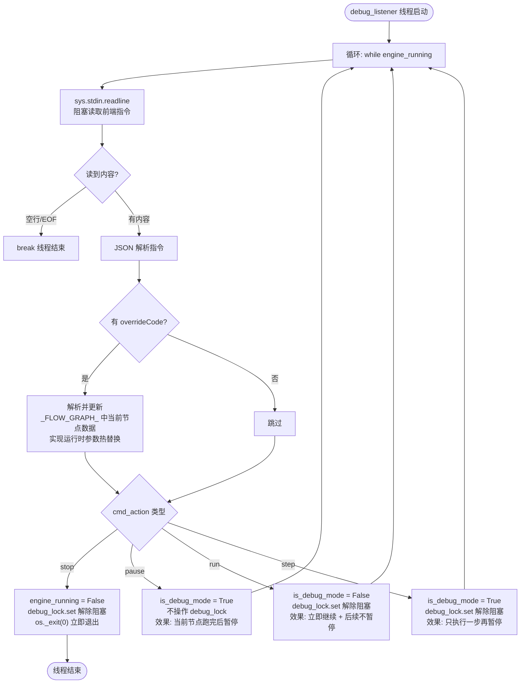
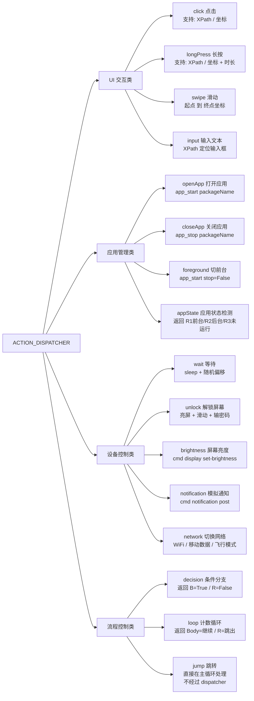
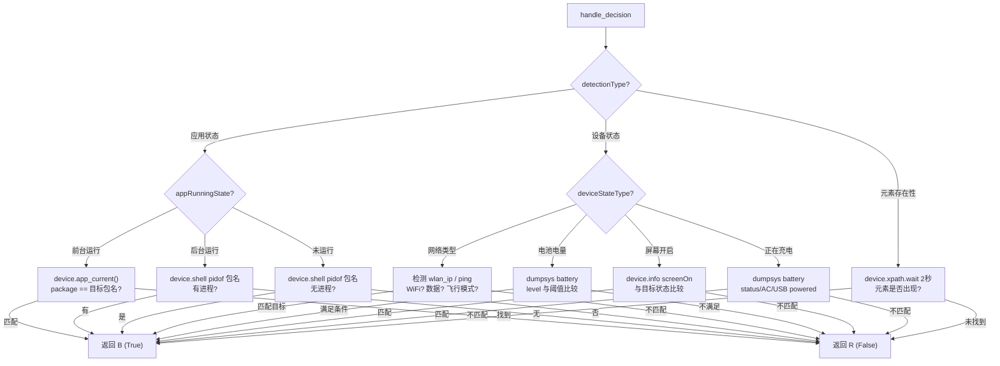
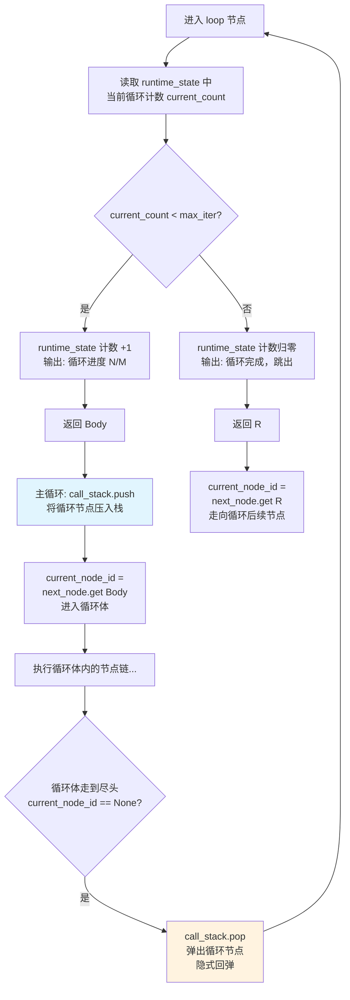
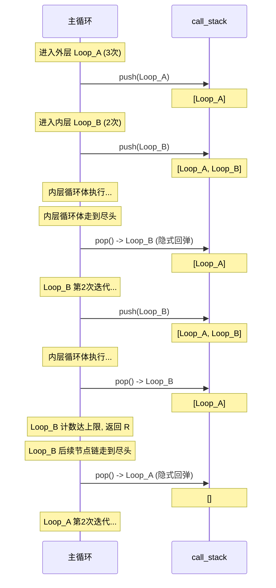
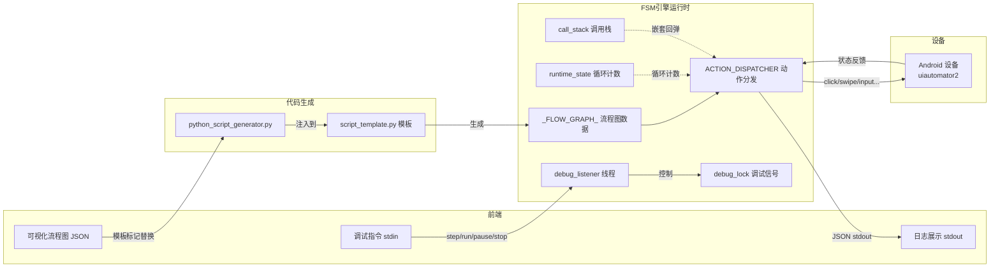

# FSM 执行引擎详细流程图（Mermaid）

## 一、总体流程图

```mermaid
flowchart TD
    A([脚本入口 __main__]) --> B[run_script]

    subgraph INIT ["初始化阶段"]
        B --> C{读取设备序列号<br/>优先级: 环境变量 > 代码变量 > None}
        C --> D[u2.connect 连接设备]
        D --> E{连接成功?}
        E -- 否 --> F[输出 init error<br/>sys.exit 1]
        E -- 是 --> G[输出 init success]
        G --> H[初始化状态变量<br/>flow_graph = _FLOW_GRAPH_<br/>current_node_id = _START_NODE_ID_<br/>jump_counters = 空字典<br/>runtime_state.clear<br/>step_count = 0<br/>max_total_steps = 50000]
    end

    subgraph DEBUG_INIT ["调试模式初始化"]
        H --> I{_IS_DEBUG_MODE_?}
        I -- True --> J[debug_lock.clear<br/>初始为阻塞状态]
        I -- False --> K[debug_lock.set<br/>初始为放行状态]
        J --> L[启动 debug_listener<br/>后台守护线程]
        K --> L
        L --> M[初始化 call_stack = 空列表]
    end

    M --> LOOP

    subgraph LOOP ["主循环 while current_node_id AND step_count < 50000 AND engine_running"]
        direction TB
        N[step_count += 1] --> O[从 flow_graph 取出<br/>node_data = flow_graph.get current_node_id]
        O --> P{node_data 存在?}
        P -- 否 --> Q[输出错误: 节点不存在<br/>break 终止]
        P -- 是 --> R[解析 action_type 和 next_node]
        R --> S[输出 running_node 事件<br/>通知前端当前执行节点]
        S --> DEBUG_CHECK
    end

    subgraph DEBUG_CHECK ["调试断点检查"]
        T{is_debug_mode?}
        T -- 是 --> U[debug_lock.clear 设为阻塞]
        U --> V[输出 break 事件<br/>含 nodeId + action + code]
        V --> W[debug_lock.wait<br/>阻塞等待前端指令]
        W --> X{engine_running?}
        X -- 否 --> Y[break 终止]
        T -- 否 --> Z[继续执行]
        X -- 是 --> Z
    end

    Z --> ACTION_DISPATCH

    subgraph ACTION_DISPATCH ["动作分发执行"]
        direction TB
        AA{action_type == jump?}
        AA -- 是 --> AB[跳转逻辑<br/>检查 jump_counters<br/>是否超过 maxRetries]
        AB --> AC{未超最大次数?}
        AC -- 是 --> AD[current_node_id = targetNodeId<br/>continue 回主循环]
        AC -- 否 --> AE[current_node_id = next_node<br/>continue 回主循环]

        AA -- 否 --> AF{ACTION_DISPATCHER<br/>中存在 handler?}
        AF -- 否 --> AG[输出: 未知的动作类型]
        AF -- 是 --> AH{action_type == loop?}
        AH -- 是 --> AI[result = handler device, node_data, current_node_id]
        AH -- 否 --> AJ[result = handler device, node_data]
        AI --> AK[处理执行结果]
        AJ --> AL{执行成功?}
        AL -- 是 --> AM[输出: 节点执行成功]
        AL -- 否 --> AN[输出 error 事件<br/>raise 异常终止脚本]
        AM --> AK
    end

    AK --> NEXT_NODE

    subgraph NEXT_NODE ["下一节点路由"]
        direction TB
        BA{action_type == loop<br/>且 result == Body?}
        BA -- 是 --> BB[call_stack.push<br/>当前循环节点入栈]
        BA -- 否 --> BC[不压栈]

        BB --> BD{节点类型判断}
        BC --> BD

        BD -- loop 循环节点 --> BE[branch_key = result<br/>Body 或 R]
        BD -- decision 判断节点 --> BF[branch_key = result<br/>B True 或 R False]
        BD -- 普通节点 --> BG[branch_key = R]

        BE --> BH[current_node_id =<br/>next_node.get branch_key]
        BF --> BI[current_node_id =<br/>next_node.get branch_key]
        BG --> BJ[current_node_id =<br/>next_node.get R]

        BI --> BK{判断节点的另一分支<br/>指向 loop 节点?}
        BK -- 是且当前分支不是loop --> BL[call_stack.pop<br/>退出该循环层]
        BK -- 否 --> BM[不操作]

        BH --> BN{current_node_id 为空?}
        BL --> BN
        BM --> BN
        BJ --> BN

        BN -- 是且 call_stack 非空 --> BO[current_node_id =<br/>call_stack.pop<br/>隐式回弹到循环节点]
        BN -- 否 --> BP[回到主循环顶部]
        BO --> BP
    end

    BP --> N

    Q --> END_CHECK
    Y --> END_CHECK
    AG --> NEXT_NODE

    subgraph END_CHECK ["结束判定"]
        CA{step_count >= 50000?}
        CA -- 是 --> CB[输出: 触发全局安全锁<br/>强制停止]
        CA -- 否 --> CC{current_node_id == None?}
        CC -- 是 --> CD[输出: 所有节点执行完毕]
        CC -- 否 --> CE[engine_running == False<br/>被调试线程终止]
    end
```

---

## 二、调试监听线程（debug_listener）

---

## 三、ACTION_DISPATCHER 动作类型全览

---

## 四、条件分支（decision）判断逻辑

---

## 五、循环节点（loop）与调用栈协作

### 循环嵌套示例（调用栈变化）

---

## 六、完整数据流概览

