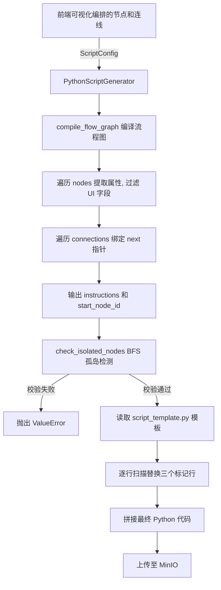
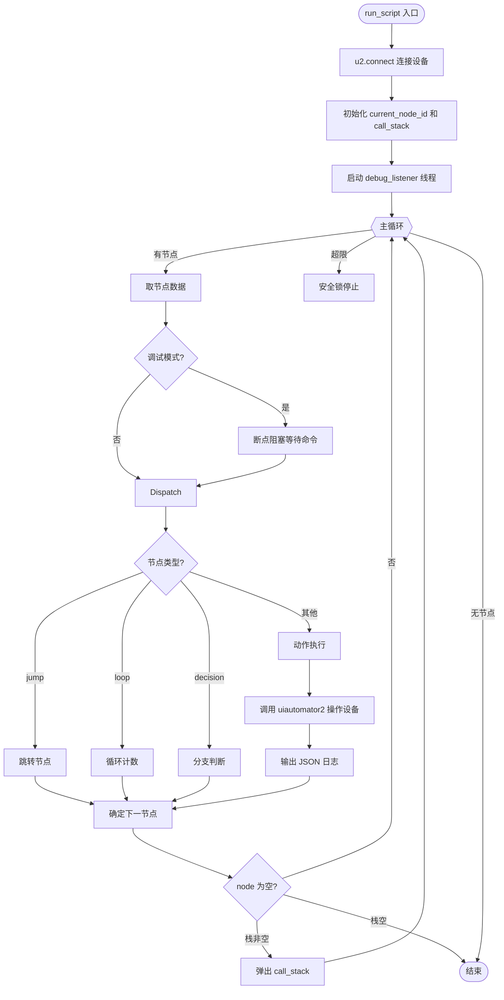

# 任务以模板运行的完整流程

## 整体架构概览

任务（Task）通过关联模板（Template）间接关联多个脚本（Script），运行时按 `sort_order` 顺序依次执行每个脚本，日志通过 SSE 实时推送至前端。

---

## 核心流程 Mermaid 图

```mermaid
sequenceDiagram
    participant FE as 前端 (Browser)
    participant RT as 任务路由 (task_router.py)
    participant DB as 数据库 (MySQL)
    participant RS as 任务运行服务 (task_run_service.py)
    participant MO as MinIO 存储
    participant FS as 临时文件系统
    participant SP as Python 子进程 (script_template.py)
    participant DV as Android 设备

    Note over FE, RT: ═══ 阶段一：任务触发 ═══

    FE->>+RT: POST /api/task/run/taskId
    RT->>DB: 查询 TaskInfo 获取 template_id
    DB-->>RT: 返回任务信息 (template_id, device_id)

    rect rgb(240, 248, 255)
        Note over RT, DB: 解析模板关联的脚本
        RT->>DB: 查询 ScriptTemplateRel<br/>按 sort_order 升序排列
        DB-->>RT: 返回关联脚本列表 [rel1, rel2, ...]

        loop 遍历每个 rel
            RT->>DB: 查询 ScriptInfo (script_id)
            DB-->>RT: 返回 script_id 和 latest_version
            Note right of RT: 拼接 MinIO 路径<br/>scripts/scriptId/version.py
        end
    end

    RT->>RT: 生成 run_id = uuid4().hex
    RT->>RS: asyncio.create_task(execute_task)<br/>传入 run_id, task_id, device_id, script_py_paths
    RT-->>-FE: 立即返回 {"runId": "xxx"}
    Note right of FE: 前端收到 runId 后<br/>立即建立 SSE 连接订阅日志

    Note over FE, RT: ═══ 阶段二：SSE 日志订阅 ═══

    FE->>+RT: GET /api/task/run/logs/runId<br/>(EventSource 连接)

    rect rgb(255, 248, 240)
        Note over RT, RS: 等待后台协程创建 Queue
        RT->>RS: get_run_queue(run_id)
        Note right of RT: 轮询等待队列创建<br/>每 100ms 检查一次, 最多 50 次
        RS-->>RT: 返回 asyncio.Queue 引用
    end

    Note over FE, DV: ═══ 阶段三：后台顺序执行脚本 ═══

    RS->>RS: 创建 asyncio.Queue<br/>注册到全局 _run_queues
    Note right of RS: 初始化 all_logs=[], has_error=False,<br/>was_stopped=False, start_time=now()

    loop 按顺序执行每个脚本 (idx = 1..N)
        RS->>RS: 检查 _run_cancelled[run_id]
        alt 已被用户取消
            RS-->>RT: queue.put("任务已被用户手动停止")
            RT-->>FE: SSE: type=warning
            Note right of RS: was_stopped=True, break 跳出循环
        end

        rect rgb(240, 248, 255)
            Note over RS, MO: 从 MinIO 下载脚本
            RS->>MO: get_file_content(py_path)
            MO-->>RS: 返回 Python 脚本源码字符串
            alt 脚本为空或不存在
                RS-->>RT: queue.put("脚本文件为空或不存在")
                RT-->>FE: SSE: type=error
                Note right of RS: has_error=True, continue 跳过
            end
        end

        rect rgb(255, 248, 240)
            Note over RS, FS: 写入临时文件并启动子进程
            RS->>FS: tempfile.NamedTemporaryFile(suffix=".py")
            FS-->>RS: tmp_path

            RS->>SP: asyncio.create_subprocess_exec<br/>python3 -u tmp_path<br/>(stdout=PIPE, stderr=PIPE)
            Note right of RS: -u 禁用缓冲, 确保日志实时输出<br/>记录到 _run_processes[run_id]
        end

        rect rgb(240, 255, 240)
            Note over SP, DV: 子进程内部: 状态机引擎运行
            SP->>DV: u2.connect() 连接 Android 设备
            DV-->>SP: 返回 device 对象

            loop 状态机主循环 (while current_node_id)
                SP->>SP: 从 FLOW_GRAPH 取当前节点
                SP->>SP: ACTION_DISPATCHER 分发到 Handler
                SP->>DV: 执行操作 (click, swipe, input 等)
                DV-->>SP: 操作结果
                SP->>SP: print(JSON) 输出日志到 stdout
            end
        end

        rect rgb(248, 240, 255)
            Note over RS, SP: 父协程并发读取子进程输出
            RS->>RS: asyncio.gather(read_stdout, read_stderr)

            loop stdout 持续输出
                SP-->>RS: stdout: {"type":"log", "message":"..."}
                RS->>RS: 解析 JSON, 推入 queue
                RS-->>RT: queue.put(log_event)
                RT-->>FE: SSE: type=info/success
            end

            loop stderr 错误输出
                SP-->>RS: stderr: 错误信息
                RS->>RS: has_error=True, 推入 queue
                RS-->>RT: queue.put(error_event)
                RT-->>FE: SSE: type=error
            end

            RS->>RS: await process.wait()
        end

        alt 进程被 kill (用户取消)
            RS-->>RT: queue.put("任务已被用户手动停止")
            RT-->>FE: SSE: type=warning
            Note right of RS: was_stopped=True, break
        else 退出码非零
            RS-->>RT: queue.put("脚本退出码: N")
            RT-->>FE: SSE: type=error
            Note right of RS: has_error=True
        else 正常完成
            RS-->>RT: queue.put("脚本 idx 执行完毕")
            RT-->>FE: SSE: type=success
        end

        RS->>FS: os.unlink(tmp_path) 删除临时文件
    end

    Note over FE, DV: ═══ 阶段四：收尾与持久化 ═══

    rect rgb(255, 245, 238)
        Note over RS, MO: 判定状态并持久化
        RS->>RS: 判定 exec_status<br/>was_stopped -> CANCELLED<br/>has_error -> FAILED<br/>else -> SUCCESS
        RS-->>RT: queue.put("任务运行结束, 状态: xxx")
        RT-->>FE: SSE: type=info

        RS->>MO: upload_file(logs/tasks/taskId/runId.log)<br/>上传完整日志文本
        RS->>DB: INSERT ScriptExecLog<br/>(log_id, task_id, device_id,<br/>exec_status, log_file_url,<br/>start_time, end_time)
    end

    RS-->>RT: queue.put({"type":"finished"})
    RT-->>-FE: SSE: type=finished
    FE->>FE: 前端关闭 EventSource 连接

    RS->>RS: asyncio.sleep(5) 延迟清理
    RS->>RS: 清理 _run_queues, _run_processes, _run_cancelled

    Note over FE, DV: ═══ 阶段五：用户手动停止 (可选) ═══

    alt 用户点击停止按钮
        FE->>RT: POST /api/task/stop/runId
        RT->>RS: stop_run(run_id)
        RS->>RS: _run_cancelled[run_id] = True
        RS->>SP: process.kill() 杀掉当前子进程
        RT-->>FE: {"success": true}
        Note right of RS: 主循环下一轮检测到 cancelled<br/>触发收尾流程
    end
```



---

## 脚本代码生成流程

任务关联的每个脚本，在保存时已经通过 `PythonScriptGenerator` 生成并上传至 MinIO。代码生成过程如下：



对应代码位于 `engine/python_script_generator.py`：

- `_compile_flow_graph()`（第 70-127 行）：将可视化节点和连线编译为 `instructions` 字典
  - 遍历节点：提取 `properties`，过滤掉 `loc/color/icon` 等 UI 字段
  - 遍历连线：建立 `next` 指针映射，识别 Start 节点出口
- `_check_isolated_nodes()`（第 129-182 行）：BFS 遍历检查是否有孤岛节点
- `_generate_internal()`（第 32-68 行）：读取模板文件，替换三个标记行
  - `# __FLOW_GRAPH__` → 填入 `instructions` JSON
  - `# __START_NODE__` → 填入起始节点 ID
  - `# __IS_DEBUG__` → 填入 `True`（调试）或 `False`（任务运行）

---

## 状态机引擎执行逻辑

子进程中运行的 `script_template.py` 是一个状态机引擎，核心执行逻辑：



对应代码位于 `engine/script_template.py` 的 `run_script` 函数（第 441-636 行）：

### 状态机主循环

```python
while current_node_id and step_count < max_total_steps and engine_running:
    node_data = flow_graph.get(current_node_id)
    action_type = node_data.get("type")
    # 调试模式下阻塞等待
    if is_debug_mode:
        debug_lock.clear()
        debug_lock.wait()
    # 分发到对应 handler
    handler_func = ACTION_DISPATCHER.get(action_type)
    result = handler_func(device, node_data)
    # 确定下一节点
    current_node_id = next_node.get(branch_key)
```

### ACTION_DISPATCHER 动作注册表

| 动作类型 | Handler 函数 | 说明 |
|---------|-------------|------|
| `click` | `handle_click` | 点击（XPath / 坐标） |
| `longPress` | `handle_long_press` | 长按 |
| `swipe` | `handle_swipe` | 滑动 |
| `input` | `handle_input` | 输入文本 |
| `wait` | `handle_wait` | 等待延时 |
| `openApp` | `handle_open_app` | 打开应用 |
| `closeApp` | `handle_close_app` | 关闭应用 |
| `foreground` | `handle_foreground` | 切换前台 |
| `appState` | `handle_app_state` | 检测应用状态 |
| `decision` | `handle_decision` | 分支判断 |
| `loop` | `handle_loop` | 计数循环 |
| `unlock` | `handle_unlock` | 解锁屏幕 |
| `brightness` | `handle_brightness` | 调节亮度 |
| `notification` | `handle_notification` | 模拟通知 |
| `network` | `handle_network` | 切换网络模式 |

### 调试模式控制命令

| 命令 | is_debug_mode | debug_lock | 效果 |
|------|:---:|:---:|------|
| `stop` | - | set | 进程直接退出 |
| `pause` | True | 不动 | 当前节点跑完后暂停 |
| `run` | False | set | 解除阻塞，后续不再暂停 |
| `step` | True | set | 解除阻塞，下个节点继续暂停 |

---

## 关键数据结构说明

### `_FLOW_GRAPH_` (指令集)

由 `PythonScriptGenerator._compile_flow_graph()` 生成，结构示例：

```json
{
  "node_abc": {
    "type": "click",
    "properties": {
      "targetType": "XPath",
      "elementId": "//android.widget.Button[@text='登录']"
    },
    "next": { "R": "node_def" }
  },
  "node_def": {
    "type": "decision",
    "properties": {
      "detectionType": "元素存在性",
      "xpath": "//android.widget.TextView[@text='首页']"
    },
    "next": { "B": "node_ghi", "R": "node_jkl" }
  },
  "node_loop1": {
    "type": "loop",
    "properties": { "iterations": 3 },
    "next": { "Body": "node_abc", "R": "node_end" }
  }
}
```

### 节点出口端口约定

| 节点类型 | 出口端口 | 说明 |
|---------|---------|------|
| 普通动作节点 | `R` (default) | 唯一出口，执行完后走下一步 |
| 分支判断 (decision) | `B` / `R` | B = 条件为真，R = 条件为假 |
| 循环 (loop) | `Body` / `R` | Body = 继续循环体，R = 循环结束 |
| 跳转 (jump) | `targetNodeId` | 直接跳转到指定节点 |
| 应用状态 (appState) | `R1` / `R2` / `R3` | 前台 / 后台 / 未运行 |

### 全局运行注册表 (`task_run_service.py`)

```python
_run_queues:     Dict[str, asyncio.Queue]            # run_id → SSE 日志队列
_run_processes:  Dict[str, asyncio.subprocess.Process] # run_id → 当前子进程
_run_cancelled:  Dict[str, bool]                      # run_id → 是否已取消
```

- **`_run_queues`**：后台协程产生日志 → `queue.put()` → SSE 端点 `queue.get()` → 前端
- **`_run_processes`**：记录当前子进程引用，支持 `stop_run()` 时 `proc.kill()`
- **`_run_cancelled`**：标记取消状态，主循环每轮检查

### 完整调用链

```
前端点击"运行"
  → POST /api/task/run/{taskId}
    → 查 DB: TaskInfo → template_id
    → 查 DB: ScriptTemplateRel (按 sort_order)
    → 查 DB: ScriptInfo → 拼 MinIO 路径
    → asyncio.create_task(execute_task(...))
    → 返回 runId

前端订阅日志
  → GET /api/task/run/logs/{runId} (SSE)
    → event_generator() 从 Queue 读取并推送

后台 execute_task 协程
  → 遍历 script_py_paths
    → MinIO 下载 .py 源码
    → 写入临时文件
    → asyncio.create_subprocess_exec(python3 -u tmp.py)
    → 子进程内 run_script() 启动状态机引擎
      → 连接 Android 设备
      → while 循环逐节点执行
      → print(JSON) 输出日志到 stdout
    → 父协程并发读 stdout/stderr → queue.put()
  → 上传完整日志到 MinIO
  → 写入 ScriptExecLog 到数据库
  → queue.put({"type": "finished"})
```
